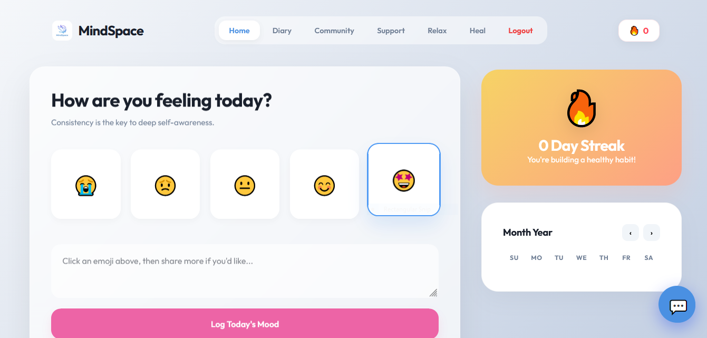
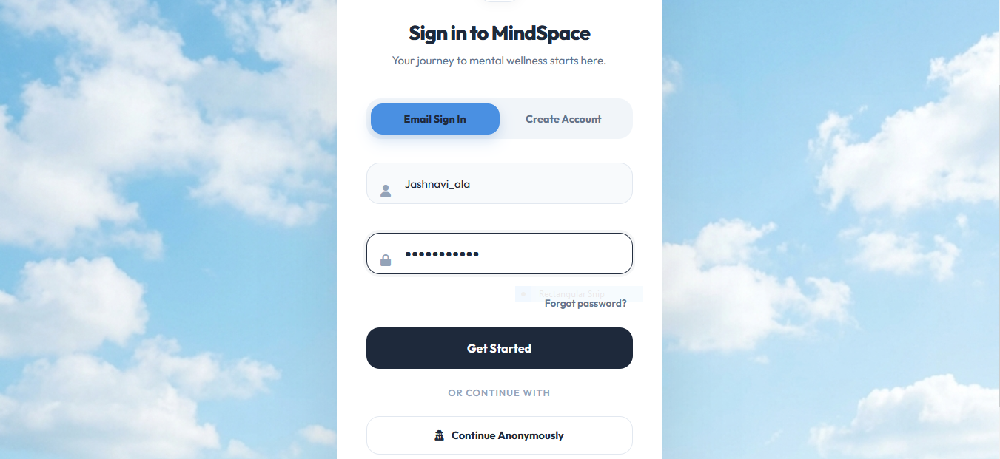
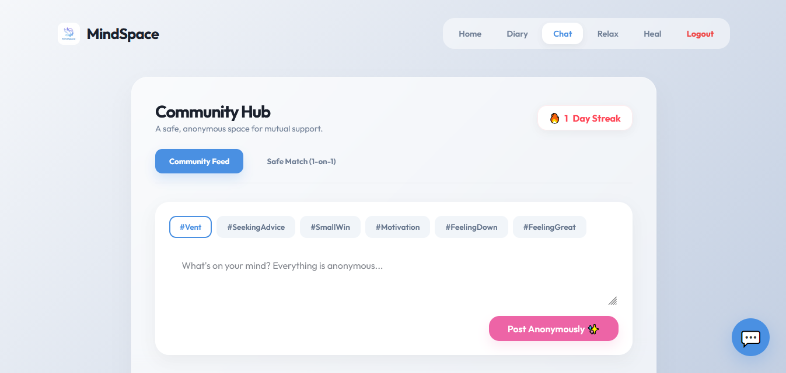
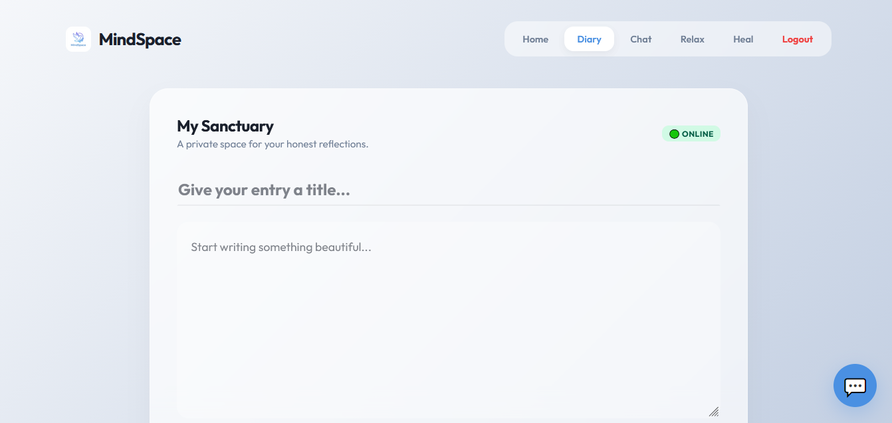
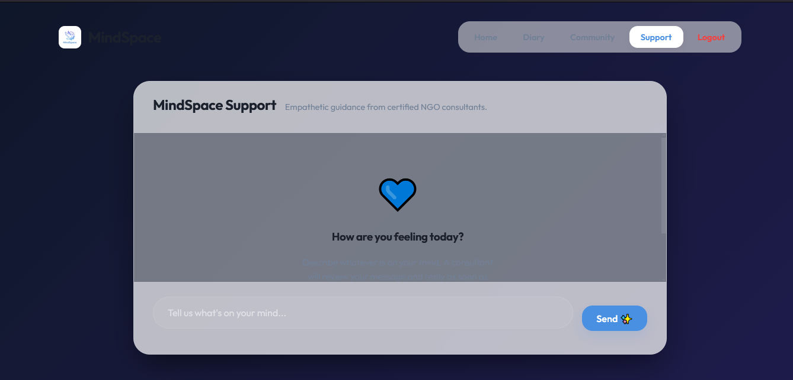

# 🧠 MindSpace

MindSpace is a youth mental health and emotional support platform built using HTML, CSS, JavaScript, Node.js, Express.js, and MongoDB.

The platform is designed to provide a safe digital space for users to express emotions, maintain personal journals, track moods, and access support through chat-based systems and wellness tools.

---

## 📌 Table of Contents

- Overview
- Features
- Tech Stack
- Screenshots
- Installation
- Future Improvements
- Author

---

## 📖 Overview

MindSpace focuses on improving mental well-being among youth by providing a structured and safe digital environment.

It allows users to:
- Express thoughts and emotions
- Track mood over time
- Maintain a personal diary
- Communicate through support chat systems
- Access relaxation and wellness tools

The goal is to combine technology with mental health awareness to promote emotional stability and self-care.

---

## ✨ Features

- AI-based chat support system for emotional assistance  
- Personal diary/journaling system  
- Mood tracking and emotional logging  
- Mentor/support chat system  
- Relaxation and wellness tools  
- User authentication system  
- Admin/consultant dashboard  

---

## 🛠️ Tech Stack

### 💻 Frontend
- HTML  
- CSS  
- JavaScript  

### ⚙️ Backend
- Node.js  
- Express.js  

### 🗄️ Database
- MongoDB  

### 🔧 Other
- REST APIs  
- WebSockets (if used)  
- Git & GitHub  

---

## 📸 Screenshots

Add your project screenshots here.

### 🏠 Home Dashboard

### 🔐 Login Page

### 💬 Chat System

### 📖 Diary Page

### 😊 Support

